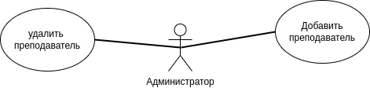
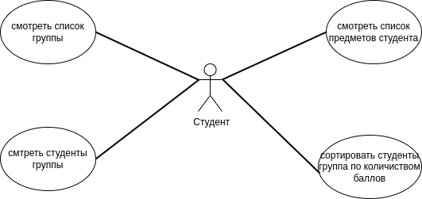
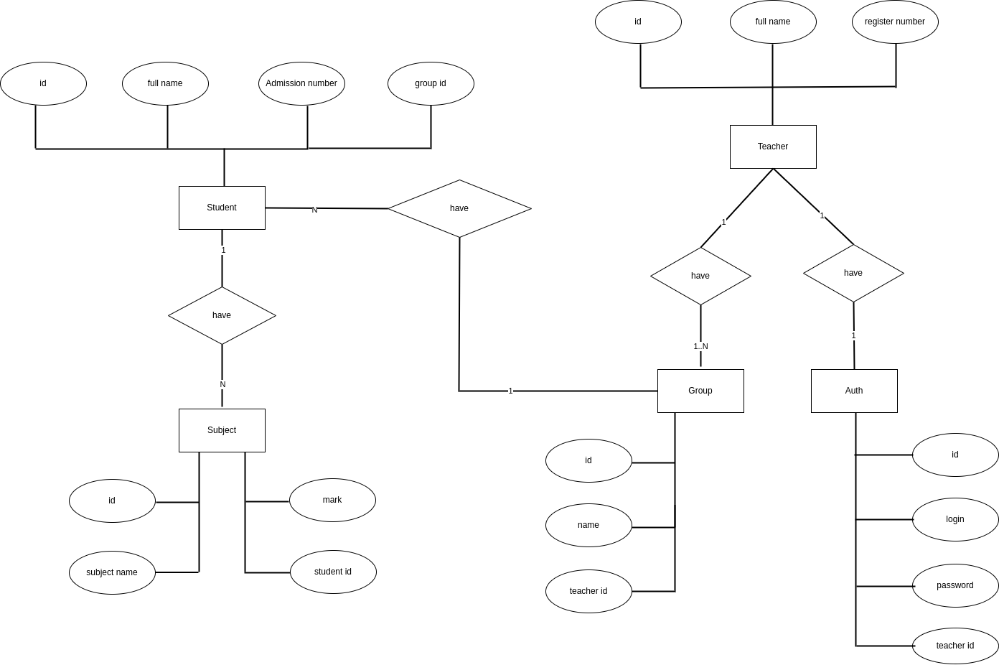

# Вотоая лаба ППО

1. Название проекта

    ## Result sheet
2. Краткое описание идеи проекта 
   
   В школных временах бывали у меня на родине экзамены, экзамены сдаются два раза в год на родине что сдать экзамена надо было набрать минимальный балл и на первом экзамене это было 16 из 40 и на втором это было 26 из 60 но среднием должен студент набрал бы 50+ баллов.

   рассчитывать бы пришлось старшими учителями, выглядит легкая работа но когда студенты в некоторых классах больше 30+ и также колчество придметов 7-10, учителей часто бы ошибались с результатами с рассчитом средней балл и также с сортировкой общие оценки студентов особено в последных классах когда учителей расситивали раза 3 чтобы увидится на верность результатов.

   моя идея написать программу для школы, которая дает возможность сделать все это автоматический только с добавлений классов и также студентов и их оценки рассчитывать все это автоматический и ...
3. Краткое описание предметной области 
    
    программа поможет проподавателям чтобы облегчить их работы с баллами студентов и также поможет студентам чтобы узнать свое результаты.

    будет доступено в открытом виде всеми сотрудниками школы но с огранеченами доступами.

4. Краткий анализ аналогичных решений по 3 критериям
    
    до сих я аналог такого программа не видел однако наш ЭУ дает нам такой возможности для рассмотреный своих результатов в течение семестра и также в конце сессия.

5. Краткое обоснование целесообразности и актуальности проекта

    я не знаю как это делается в россии и также в других стран но такой программы пока нет в никаких школах на родине.

6. Use-Case - диаграмма

    use-case диаграмма администратора
    

    use-case диаграмма учители
    

    use-case диаграмма студента
    
7. ER-диаграмма сущностей

    

8. Верхнеуровневое разбиение на компоненты
   
   

9. Uml diagram
   

10. Архитектурные характеристики
   
    1- Надёжность

    2- Консистентность данных

    3- Отказоустойчивость

    4- Масштабируемость

11. Технологический стек
    
    Desktop App

    BackEnd - c++

    FrontEnd - Qt

    Test - Gtest

    Database - PostgreSQL